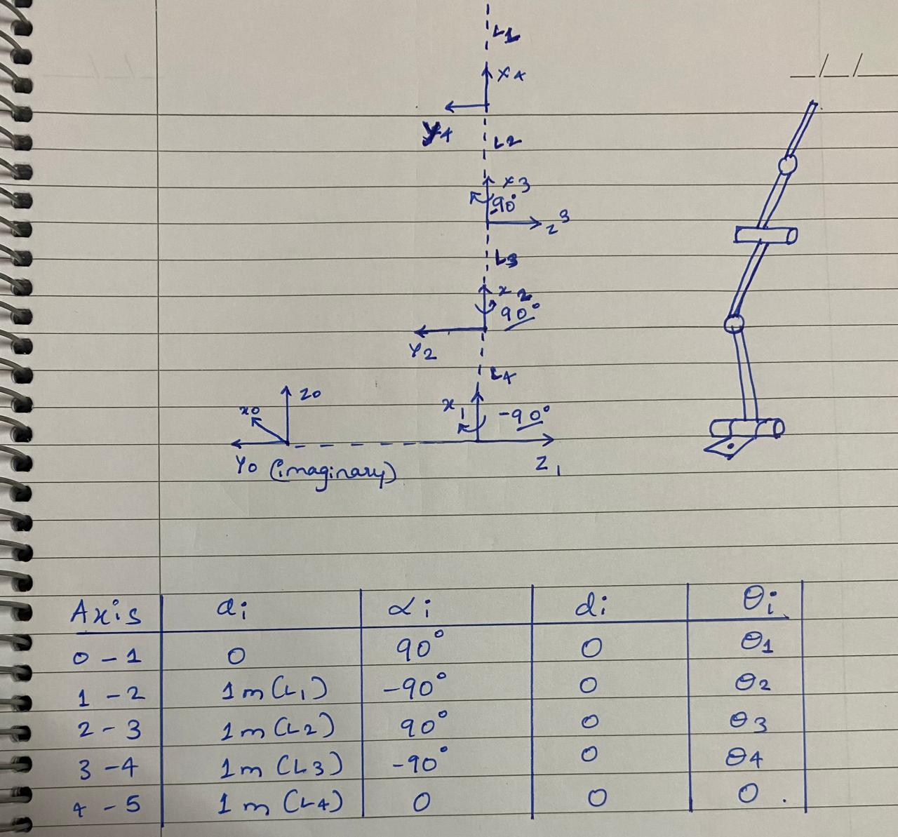

# FORWARD KINEMATICS <fwd_kin>

**clone the package into your home**  
```bash
git clone https://github.com/abhiDharwad/forward_kinematics.git
```
```bash
python3 fwd_kin.py   
```   
# i have created the dh table by looking at the robot from different perspective   but the joint axis still remains the same   


# it will ask you to add the join angles      


# it will show the position of the end_effector      
   